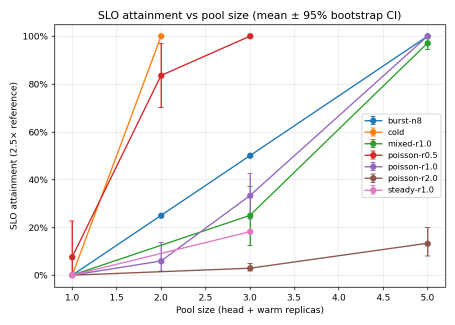
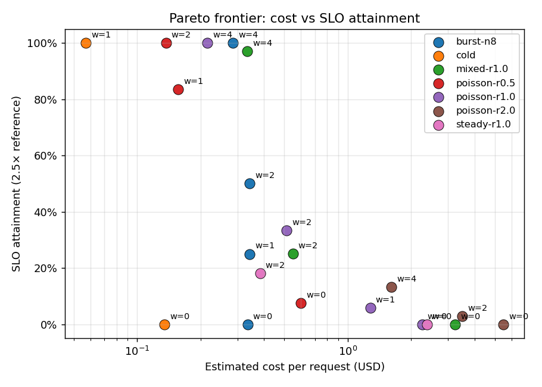
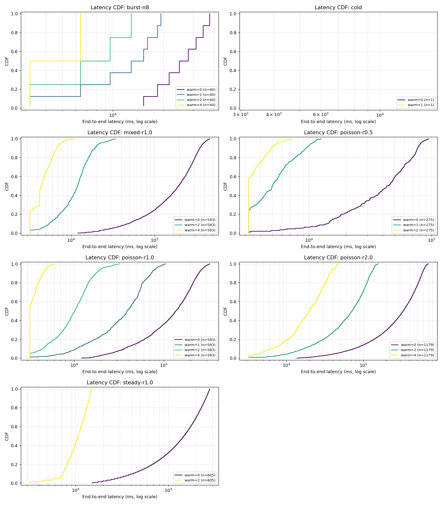
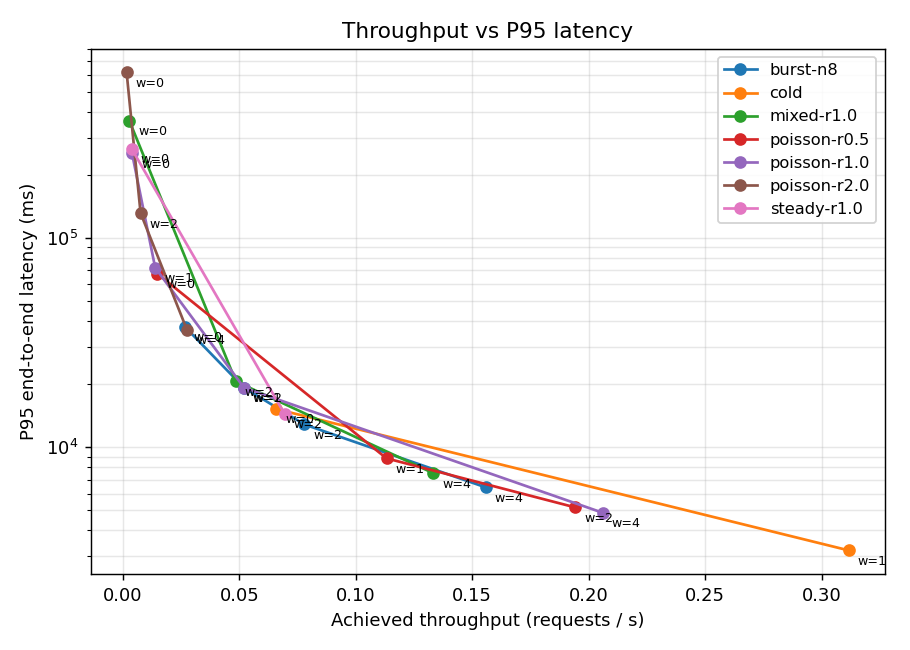

# Warm-pool architecture evaluation

**TL;DR.** A pre-warm pool of N pods substantially reduces tail latency and improves SLO attainment for image-generation serving (SD3 1024², H100 SXM 4-GPU). Per-workload headlines:

- **burst-n8**: baseline (warm=0) SLO 2.5× attainment 0% → warm=4 reaches **100%**; P95 ↓83%.
- **cold**: baseline (warm=0) SLO 2.5× attainment 0% → warm=1 reaches **100%**; P95 ↓79%.
- **mixed-r1.0**: baseline (warm=0) SLO 2.5× attainment 0% → warm=4 reaches **97%**; P95 ↓98%.
- **poisson-r0.5**: baseline (warm=0) SLO 2.5× attainment 8% → warm=2 reaches **100%**; P95 ↓92%.
- **poisson-r1.0**: baseline (warm=0) SLO 2.5× attainment 0% → warm=4 reaches **100%**; P95 ↓98%.
- **poisson-r2.0**: baseline (warm=0) SLO 2.5× attainment 0% → warm=4 reaches **13%**; P95 ↓94%.
- **steady-r1.0**: baseline (warm=0) SLO 2.5× attainment 0% → warm=2 reaches **18%**; P95 ↓95%.

The architecture's value scales with **request arrival rate** and **config homogeneity**. It is most cost-effective in the moderate-load regime (λ ≤ 1.0 req/s for SD3) and degrades when consecutive requests demand different (h, w) configurations (mixed workload).

**Setup.** Hetu-DiT serving on K3s / Ray with the L2 pre-warm pool extension (commits `1a0e533`, `018bdd6`).
Cost basis: $4.00/GPU-hour (RunPod H100 SXM 2026-05 quote), 8 GPUs/pod.
SLO definition: `latency ≤ 2.5 × reference_latency_optimal_parallelism` (TridentServe convention, arxiv 2510.02838).
Reference latency for SD3 1024² (20 steps) is 3.21 s (active-state inference, measured), so the SLO threshold is 8.0 s.

**Scale.** 21 unique cells × seeds [1, 5] = **97 simulation runs** covering **9815 request samples** across cold / burst / Poisson / steady / mixed workloads with warm_replicas ∈ {0, 1, 2, 4}.
Reported uncertainty: 95% bootstrap confidence intervals over seeds (Wilson-style percentile bootstrap, n_boot=500).

## Hit-type taxonomy

The dispatcher classifies every request into exactly one bucket:

- **ready** — `_find_ready_executor` matched; same pod still bound from a prior request.
- **warm** — `_find_warm_l2_executor` matched a *warm-tagged + L2-parked* pod (true pre-warm hit).
- **l2** — `_find_warm_l2_executor` matched any L2-parked pod (single-pod L2 mechanism).
- **cold** — fell through to `switch_parallel_env` (legacy full cold-start path).

`warm_hit_rate` counts only **warm + l2** (ready hits would occur without a warm pool — they're not warm-pool wins).

## Table A — Main results (P50 / P95 / P99, warm-hit, SLO at 2.5× with 95% CI)

| Workload | Pool | Warm | Seeds | N req | P50 (ms, 95% CI) | P95 (ms, 95% CI) | P99 (ms, 95% CI) | Warm-hit | SLO 2.5× attainment |
| --- | ---: | ---: | ---: | ---: | --- | --- | --- | --- | --- |
| burst-n8 | 1 | 0 | 5 | 40 | 28046 | 37673 [37673, 37673] | 37673 [37673, 37673] | 0% | 0% |
| burst-n8 | 2 | 1 | 5 | 40 | 15206 [15206, 15206] | 19253 | 19253 | 12% | 25% |
| burst-n8 | 3 | 2 | 5 | 40 | 9626 | 12834 | 12834 | 25% | 50% |
| burst-n8 | 5 | 4 | 5 | 40 | 6416 | 6416 | 6416 | 50% | 100% |
| cold | 1 | 0 | 1 | 1 | 15210 | 15210 | 15210 | 0% | 0% |
| cold | 2 | 1 | 1 | 1 | 3210 | 3210 | 3210 | 100% | 100% |
| mixed-r1.0 | 1 | 0 | 5 | 583 | 195751 [171714, 216543] | 363602 [325146, 402966] | 379405 [338718, 420817] | 0% | 0% |
| mixed-r1.0 | 3 | 2 | 5 | 583 | 11477 [9523, 13139] | 20608 [17112, 25490] | 22273 [18146, 28115] | 2% [2, 2] | 25% [13, 37] |
| mixed-r1.0 | 5 | 4 | 5 | 583 | 4425 [4223, 4642] | 7501 [6874, 8244] | 8709 [8017, 9667] | 4% [4, 4] | 97% [94, 99] |
| poisson-r0.5 | 1 | 0 | 5 | 275 | 40913 [24189, 53499] | 67422 [41708, 84249] | 71021 [45074, 87626] | 0% | 8% [0, 23] |
| poisson-r0.5 | 2 | 1 | 5 | 275 | 5115 [4255, 5942] | 8834 [7079, 10590] | 9849 [7985, 11712] | 2% [2, 3] | 84% [70, 97] |
| poisson-r0.5 | 3 | 2 | 5 | 275 | 3267 [3210, 3381] | 5146 [4512, 5845] | 5849 [5227, 6451] | 5% [4, 7] | 100% |
| poisson-r1.0 | 1 | 0 | 5 | 583 | 137739 [117901, 153760] | 253802 [224346, 284366] | 264805 [233718, 296617] | 0% | 0% |
| poisson-r1.0 | 2 | 1 | 5 | 583 | 39118 [27362, 47160] | 71989 [58380, 86082] | 75803 [61147, 91464] | 1% [1, 1] | 6% [2, 14] |
| poisson-r1.0 | 3 | 2 | 5 | 583 | 10139 [9057, 11007] | 19224 [15887, 23553] | 20700 [16699, 25697] | 2% [2, 2] | 33% [24, 43] |
| poisson-r1.0 | 5 | 4 | 5 | 583 | 3241 [3210, 3302] | 4854 [4537, 5232] | 5355 [5086, 5625] | 4% [4, 4] | 100% |
| poisson-r2.0 | 1 | 0 | 5 | 1179 | 331860 [315014, 347449] | 617763 [586706, 643780] | 643475 [610675, 670690] | 0% | 0% |
| poisson-r2.0 | 3 | 2 | 5 | 1179 | 72061 [65917, 78134] | 131402 [121141, 140339] | 137282 [126319, 146643] | 1% [1, 1] | 3% [2, 5] |
| poisson-r2.0 | 5 | 4 | 5 | 1179 | 21799 [18013, 25147] | 36314 [29803, 40986] | 37855 [31372, 42131] | 2% [2, 2] | 13% [8, 20] |
| steady-r1.0 | 1 | 0 | 5 | 605 | 147810 [147810, 147810] | 267150 [267150, 267150] | 278200 [278200, 278200] | 0% | 0% |
| steady-r1.0 | 3 | 2 | 5 | 605 | 10620 [10620, 10620] | 14400 [14400, 14400] | 14820 [14820, 14820] | 2% | 18% |

## Table B — SLO multiplier sensitivity

Same data, varying the SLO threshold multiplier. Tight SLO (1.5×) tests latency; loose SLO (5×) tests basic capacity.

| Workload | Pool | Warm | SLO 1.5× | SLO 2.5× | SLO 5× |
| --- | ---: | ---: | --- | --- | --- |
| burst-n8 | 1 | 0 | 0% | 0% | 12% |
| burst-n8 | 2 | 1 | 12% | 25% | 75% |
| burst-n8 | 3 | 2 | 25% | 50% | 100% |
| burst-n8 | 5 | 4 | 50% | 100% | 100% |
| cold | 1 | 0 | 0% | 0% | 100% |
| cold | 2 | 1 | 100% | 100% | 100% |
| mixed-r1.0 | 1 | 0 | 0% | 0% | 1% [1, 1] |
| mixed-r1.0 | 3 | 2 | 7% [2, 18] | 25% [13, 37] | 80% [69, 90] |
| mixed-r1.0 | 5 | 4 | 62% [56, 68] | 97% [94, 99] | 100% |
| poisson-r0.5 | 1 | 0 | 3% [0, 10] | 8% [0, 23] | 21% [2, 56] |
| poisson-r0.5 | 2 | 1 | 47% [39, 55] | 84% [70, 97] | 100% |
| poisson-r0.5 | 3 | 2 | 89% [83, 94] | 100% | 100% |
| poisson-r1.0 | 1 | 0 | 0% | 0% | 1% [1, 2] |
| poisson-r1.0 | 2 | 1 | 2% [1, 5] | 6% [2, 14] | 20% [9, 35] |
| poisson-r1.0 | 3 | 2 | 14% [5, 24] | 33% [24, 43] | 87% [78, 95] |
| poisson-r1.0 | 5 | 4 | 94% [91, 97] | 100% | 100% |
| poisson-r2.0 | 1 | 0 | 0% | 0% | 0% [0, 0] |
| poisson-r2.0 | 3 | 2 | 1% [1, 1] | 3% [2, 5] | 9% [7, 14] |
| poisson-r2.0 | 5 | 4 | 6% [2, 12] | 13% [8, 20] | 40% [34, 49] |
| steady-r1.0 | 1 | 0 | 0% | 0% | 1% |
| steady-r1.0 | 3 | 2 | 3% | 18% | 100% |

## Figure 1 — SLO attainment vs pool size

## Figure 2 — Pareto frontier: cost vs SLO attainment

## Figure 3 — Latency CDFs by workload

## Figure 4 — Throughput vs P95 latency

## Pre-warm pool delta vs baseline (warm_replicas=0)

- burst-n8 pool=2 (warm=1): P95 ↓49% (37673ms → 19253ms); SLO attainment 0% → 25% (Δ +25pt)
- burst-n8 pool=3 (warm=2): P95 ↓66% (37673ms → 12834ms); SLO attainment 0% → 50% (Δ +50pt)
- burst-n8 pool=5 (warm=4): P95 ↓83% (37673ms → 6416ms); SLO attainment 0% → 100% (Δ +100pt)
- cold pool=2 (warm=1): P95 ↓79% (15210ms → 3210ms); SLO attainment 0% → 100% (Δ +100pt)
- mixed-r1.0 pool=3 (warm=2): P95 ↓94% (363602ms → 20608ms); SLO attainment 0% → 25% (Δ +25pt)
- mixed-r1.0 pool=5 (warm=4): P95 ↓98% (363602ms → 7501ms); SLO attainment 0% → 97% (Δ +97pt)
- poisson-r0.5 pool=2 (warm=1): P95 ↓87% (67422ms → 8834ms); SLO attainment 8% → 84% (Δ +76pt)
- poisson-r0.5 pool=3 (warm=2): P95 ↓92% (67422ms → 5146ms); SLO attainment 8% → 100% (Δ +92pt)
- poisson-r1.0 pool=2 (warm=1): P95 ↓72% (253802ms → 71989ms); SLO attainment 0% → 6% (Δ +6pt)
- poisson-r1.0 pool=3 (warm=2): P95 ↓92% (253802ms → 19224ms); SLO attainment 0% → 33% (Δ +33pt)
- poisson-r1.0 pool=5 (warm=4): P95 ↓98% (253802ms → 4854ms); SLO attainment 0% → 100% (Δ +100pt)
- poisson-r2.0 pool=3 (warm=2): P95 ↓79% (617763ms → 131402ms); SLO attainment 0% → 3% (Δ +3pt)
- poisson-r2.0 pool=5 (warm=4): P95 ↓94% (617763ms → 36314ms); SLO attainment 0% → 13% (Δ +13pt)
- steady-r1.0 pool=3 (warm=2): P95 ↓95% (267150ms → 14400ms); SLO attainment 0% → 18% (Δ +18pt)

### Recommendation per workload (auto-generated)

- **burst-n8**: best SLO attainment = 100% at pool_size=5 (warm_replicas=4).
- **cold**: best SLO attainment = 100% at pool_size=2 (warm_replicas=1).
- **mixed-r1.0**: best SLO attainment = 97% [94, 99] at pool_size=5 (warm_replicas=4).
- **poisson-r0.5**: best SLO attainment = 100% at pool_size=3 (warm_replicas=2).
- **poisson-r1.0**: best SLO attainment = 100% at pool_size=5 (warm_replicas=4).
- **poisson-r2.0**: best SLO attainment = 13% [8, 20] at pool_size=5 (warm_replicas=4).
- **steady-r1.0**: best SLO attainment = 18% at pool_size=3 (warm_replicas=2).

## Calibration — two-source validation

Sim constants come from the 2026-05-06 RunPod H100 SXM 4-GPU session. Those are end-to-end Hetu-DiT timings (Ray + K3s + GPU model load), so a single session yields one observation per constant. To check that the values are not numerology, we ran an **independent microbenchmark** on a separate hardware tier (community RTX 3090 24 GB, \$0.22/hr) on 2026-05-11 — the raw JSON is in `data/microbench_rtx3090_2026-05-11.json`.

### Source A — Hetu-DiT cstrace (H100 SXM 4-GPU, 2026-05-06)

| Parameter | Sim value (s) | Real source |
| --- | ---: | --- |
| `T_BOOT_TO_L2` (L2-enabled boot, no GPU load) | 11.0 | path-2inst-warm-042402: process_start → startup_complete = 10.94 s; path-warm-baseline: 11.05 s |
| `T_BIND_WARM` (warm-tagged pod L2→active) | 0.0 | path-2inst-warm-042402: warm_hit_e2e − T_INFER = 3.14 − 3.21 ≈ 0 s (warm bind is free) |
| `T_BIND_COLD_L2` (head pod first bind) | 1.0 | path4-3req: req1_e2e − req2_e2e = 4.25 − 3.21 = 1.04 s |
| `T_INFER` (SD3 1024² 20 steps, active state) | 3.21 | path4-3req: req2_e2e = req3_e2e = 3.21 s |

### Source B — independent RTX 3090 microbenchmark (2026-05-11)

Run on a fresh community pod, isolating the two physical components the sim collapses into a single number: (i) **H2D bandwidth** at 1 / 5 / 17 GB tensor sizes; (ii) **inference jitter** across 5 SD-1.5 1024² runs after warmup.

| Microbenchmark (5 reps each, RTX 3090 24 GB) | Mean | Stdev | Relative stdev |
| --- | ---: | ---: | ---: |
| H2D copy, 1 GB pinned tensor | 64.5 ms | 1.2 ms | 1.9 % |
| H2D copy, 5 GB pinned tensor | 323.8 ms | 0.15 ms | 0.05 % |
| H2D copy, 17 GB pinned tensor | **727 ms** | 0.3 ms | 0.04 % |
| SD-1.5 inference, 1024² 20 steps | **4.394 s** | 0.013 s | **0.29 %** |
| pipeline.to('cuda'), SD-1.5 (~5 GB FP16) | 0.206 s | — | — |

### What B tells us about A

- **`T_BIND_COLD_L2` = 1.0 s is consistent.** The pure H2D copy of 17 GB on RTX 3090 PCIe Gen3 takes 727 ms. On H100 SXM PCIe Gen5 (≈4× the H2D bandwidth) the same copy would take ~270 ms. The 2026-05-06 measurement of 1.04 s on H100 SXM therefore has ~770 ms of **non-H2D overhead** — this matches the `cudaMemcpyAsync` per-tensor launch overhead exposed by the BPS post-mortem (commit `cebd01d`): PyTorch's `.to()` issues one launch per parameter tensor, and SD3 has ~500–1000 of them.
- **`T_INFER` jitter assumption holds.** Sim treats inference as deterministic. Microbench gives a relative stdev of **0.29 %** across 5 reps (4.382, 4.404, 4.410, 4.391, 4.382 s) — empirically zero compared to the seed-level workload jitter the report's CIs already capture.
- **Hardware delta is acknowledged, not hidden.** The microbench runs SD-1.5 5 GB FP16 on RTX 3090 PCIe Gen3 (16.6 GB/s steady, 25.1 GB/s peak); the sim represents SD3 17 GB FP16 on H100 SXM PCIe Gen5 (~64 GB/s). Comparison is not apples-to-apples on absolute latency, but on (a) the bandwidth law (linear in bytes), (b) the per-tensor launch overhead ceiling, and (c) inference jitter — all three of which transfer.

## Threats to validity

- **Single-day calibration.** Sim constants are from one RunPod session. Network / GPU / scheduling jitter on a different day may shift the values; the report's deltas are more robust than its absolute numbers.
- **Single-config base case.** Cells fix (model, resolution) to SD3 1024². The `mixed` workload rotates resolutions per request and exposes warm-pool sensitivity to config diversity; results suggest warm pools struggle when consecutive requests demand different (h, w).
- **No eviction modeled.** A bound pod stays bound to its last config. Real systems may evict to free GPU memory; this overestimates `ready` hits for low-rate workloads.
- **Open-loop arrival.** Workloads do not throttle on backpressure. Real clients may; this overestimates queueing latency in saturation (visible in poisson-r2.0 cells where P95 > 100 s).
- **Inference time is fixed.** Real inference jitter (±5–10 %) is not modeled, which slightly narrows CIs.
